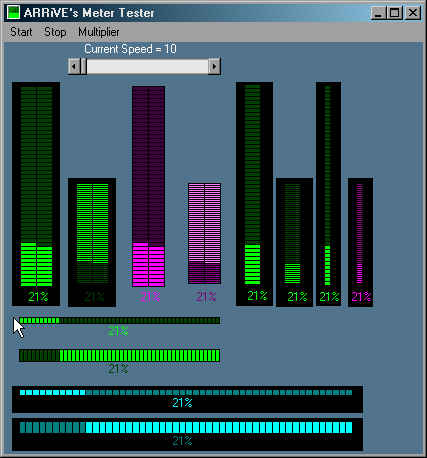



## NT Meters

### Description

Simplified NT Like Progress bars. No OCX overhead! Any colors you like can be used. I also wrote support for each bar in the Dual meter. I put them in my templates directory. Thanks to Jerrame Hertz for bits of code and concept!
 
### More Info
 
see sample

             |
---                |---
**Submitted On**   |2001-04-13 14:30:56
**By**             |[Dave Buckner](https://github.com/Planet-Source-Code/PSCIndex/blob/master/ByAuthor/dave-buckner.md)
**Level**          |Beginner
**User Rating**    |4.7 (14 globes from 3 users)
**Compatibility**  |VB 5\.0, VB 6\.0
**Category**       |[Custom Controls/ Forms/  Menus](https://github.com/Planet-Source-Code/PSCIndex/blob/master/ByCategory/custom-controls-forms-menus__1-4.md)
**World**          |[Visual Basic](https://github.com/Planet-Source-Code/PSCIndex/blob/master/ByWorld/visual-basic.md)
**Archive File**   |[NT Meters183254132001\.zip](https://github.com/Planet-Source-Code/dave-buckner-nt-meters__1-22381/archive/master.zip)

